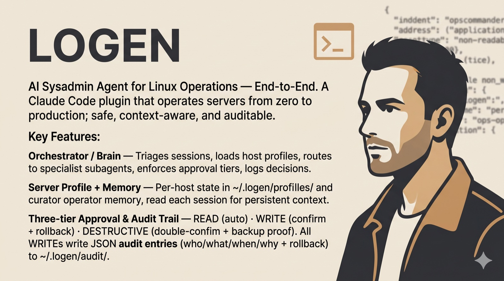

<div align="center">



# 🛡 LOGEN — Linux Operational Agent

**AI Sysadmin Agent untuk Operasi Server Linux — End-to-End**

*Plugin Claude Code yang mengoperasikan server Linux dari nol hingga produksi — **aman**, **sadar-konteks**, dan **auditable**.*

-success?style=flat-square)


[Mengapa](#mengapa-logen) · [Prinsip](#prinsip-desain-9) · [Pilar](#empat-pilar-kecerdasan) · [Kecerdasan Lanjutan](#lapisan-kecerdasan-lanjutan) · [Stack](#stack-yang-didukung) · [Skills](#skills-28) · [Subagents](#subagents-9) · [Commands](#commands-24) · [Hooks](#hooks-8) · [Tree](#struktur-repo-lengkap) · [Instalasi](#instalasi)

</div>

---

> **LOGEN adalah "kepala operasi" (chief of operations) untuk infrastruktur server Anda.**
> Bukan sekadar menjalankan perintah — ia *memahami konteks tiap host, mengingat sejarahnya, menimbang risiko sebelum bertindak, dan menjelaskan setiap keputusan.* Anda cukup menyatakan **apa** yang ingin dicapai; LOGEN mengurus **bagaimana**-nya, dengan jaring pengaman di setiap langkah.

## Mengapa LOGEN?

| Tanpa LOGEN | Dengan LOGEN |
|---|---|
| 🧩 Best practice tersebar di ratusan dokumen | 📚 Pengetahuan operasional sebagai **skill** yang langsung dieksekusi |
| 💥 Operasi destruktif tanpa jaring pengaman | 🛡 **Tiering persetujuan** + rollback disiapkan sebelum write |
| ❄ Server "snowflake", tak ada yang ingat caranya | 🗂 **Server Profile** persisten menjaga konteks tiap host |
| ❓ Sulit menjawab "siapa mengubah apa, kapan, kenapa" | 📜 **Audit trail** lengkap dengan perintah rollback di tiap perubahan |

## Prinsip Desain (9)

| # | Prinsip | Inti |
|---|---|---|
| 1 | **Stack-agnostic** | Deteksi dulu (web/runtime/DB/OS), baru beradaptasi — tak pernah berasumsi |
| 2 | **Read-first** | Diagnosa & audit selalu read-only; write hanya setelah konteks dipahami + dikonfirmasi |
| 3 | **Rollback-ready** | Tiap write menyiapkan titik mundur dulu — commit hash, salinan config, atau backup DB |
| 4 | **Idempotent** | Perintah aman diulang tanpa menumpuk efek samping |
| 5 | **Defense-in-depth** | Keamanan berlapis — SSH, runtime, web server, DB, filesystem, kernel |
| 6 | **Stateful & context-aware** | Server Profile persisten → ingat konteks tiap server lintas sesi |
| 7 | **Auditable** | Tiap perubahan tercatat: who/what/when/why + perintah rollback |
| 8 | **Confirm-before-harm** | READ otomatis · WRITE konfirmasi tunggal · DESTRUCTIVE double-confirm |
| 9 | **Server mirrors source** | Kode aplikasi hanya via VCS/deploy; file non-kode (`.env`/nginx/systemd) boleh langsung |

## Empat Pilar Kecerdasan

1. **Orchestrator / Brain** — persona agent utama: triase, muat profil, routing ke subagent spesialis, tegakkan tier, catat audit.
2. **Server Profile + Memory** — state per-host (`~/.logen/profiles/`) + memori operator kuratif (`~/.logen/memory/`), dibaca tiap awal sesi (hook `ops-context-load`).
3. **Three-tier approval** — READ (otomatis) · WRITE (konfirmasi tunggal + rollback) · DESTRUCTIVE (double-confirm + bukti backup), ditegakkan hook yang **tak bisa di-bypass LLM**.
4. **Audit trail** — tiap WRITE menulis entri JSON (who/what/when/why + rollback) ke `~/.logen/audit/`.

## Lapisan Kecerdasan Lanjutan

Di atas agent dasar, empat komponen membentuk **loop belajar tertutup** — *shadow + containment menghasilkan bukti & menekan risiko → trust memberi harga → immunity melahirkan operasi tervalidasi baru.* Semuanya **opt-in** dan menjaga garis merah keselamatan.

| Komponen | Peran |
|---|---|
| 🧪 **`ops-sandbox`** | Substrat isolasi: **rehearsal** (netns / CoW-twin / container) untuk bukti + **containment** (`systemd-run`/Landlock) untuk membatasi blast radius |
| 🔮 **`ops-shadow`** | Verifikasi pra-aksi 3-tier (T0 logika · T1 validator native · T2 twin). Hanya T1/T2 yang boleh "verified" |
| 🎚 **`ops-trust`** | Otonomi terkalibrasi: ledger Beta per-op-class; promosi butuh persetujuan manusia, demosi otomatis. DESTRUCTIVE tak pernah dipromosikan |
| 🧬 **`ops-immunity`** | Sistem imun fleet: satu insiden → antibodi (detektor + remediasi) → pindai fleet → imunisasi per-host (quorum-gated) |

**Garis merah (ditegakkan di kode):** T0 tak pernah set `shadow_verified` · DESTRUCTIVE tak pernah auto-promote · sandbox-pass saja tak pernah cukup untuk promosi · imunisasi selalu konfirmasi per-host.

## Stack yang Didukung

| Layer | Opsi |
|---|---|
| **OS** | Ubuntu 22.04/24.04 LTS, Debian 12, AlmaLinux 9, Rocky 9, CentOS Stream 9 |
| **Web Server** | Nginx, Apache (httpd), Caddy |
| **Runtime** | PHP 8.3/8.4 (FPM), Node.js 20/22 LTS, Python 3.11/3.12, Go 1.22+, Java JDK 17/21 |
| **Framework** | Laravel, Symfony, Next.js, Express, Django, FastAPI, Spring Boot, statis/SPA |
| **Database** | MySQL 8, MariaDB 10.11+, PostgreSQL 16 · Cache: Redis 7, Memcached |
| **Container** | Docker, Docker Compose, Podman |
| **Process** | systemd, PM2, Supervisor, Gunicorn/uvicorn, php-fpm pool |
| **SSL/TLS** | Let's Encrypt/Certbot (HTTP-01 & DNS-01 wildcard), TLS 1.2/1.3, Caddy auto-HTTPS |

---

## Skills (28)

Pengetahuan operasional per-domain (`skills/<name>/SKILL.md`), dimuat sesuai konteks.

**Provisioning & inti**

| Skill | Fungsi |
|---|---|
| `ops-server-core` | Bawa server kosong ke baseline aman produksi (user deploy, SSH hardening, swap, systemd) |
| `ops-discovery` | Inventaris server end-to-end → tulis ke Server Profile |
| `ops-memory` | Simpan & recall pengetahuan operator durable lintas sesi (terpisah dari Profile) |

**Web · DNS · SSL**

| Skill | Fungsi |
|---|---|
| `ops-webserver` | Konfigurasi & diagnosa Nginx/Apache/Caddy (PHP-FPM + reverse proxy) |
| `ops-dns` | Kelola record DNS + verifikasi propagasi (prasyarat SSL) |
| `ops-ssl` | Terbitkan/renew TLS via Certbot (wildcard DNS-01), HSTS, cipher modern |

**Data**

| Skill | Fungsi |
|---|---|
| `ops-database` | Setup/secure/tune MySQL/MariaDB/PostgreSQL/Redis, least-privilege, localhost-only |
| `ops-backup` | Backup terenkripsi, ter-rotate, terverifikasi ke `/var/backups` + offsite |
| `ops-secrets` | Kelola kredensial (`.env` 640 / secret manager), generasi kuat, leak audit |

**Deploy**

| Skill | Fungsi |
|---|---|
| `ops-deploy` | Pola deploy universal (zero-downtime symlink/container) + pre-flight + auto-rollback |

**Keamanan**

| Skill | Fungsi |
|---|---|
| `ops-firewall` | Konfigurasi & audit UFW/firewalld, default-deny, SSH tunnel |
| `ops-security-hardening` | Hardening host berlapis (SSH/PHP/Nginx/DB/FS/kernel) + auto-update |
| `ops-intrusion-detection` | fail2ban, AIDE integritas file, monitoring log terstruktur |
| `ops-incident-response` | Prosedur compromise/breach/outage berperingkat severity |

**Observability**

| Skill | Fungsi |
|---|---|
| `ops-monitoring` | Health check agentless (cron) + alerting |
| `ops-log-management` | Rotasi log, journald, query diagnostik lintas stack |
| `ops-performance` | Analisis & tuning performa web/runtime/DB |

**Maintenance**

| Skill | Fungsi |
|---|---|
| `ops-update-patch` | Update OS/runtime aman (apt/dnf) + backup + reboot detection + verifikasi |

**Runtimes & containers**

| Skill | Fungsi |
|---|---|
| `ops-runtime-php` | PHP-FPM pool/opcache, Composer, Laravel/Symfony |
| `ops-runtime-node` | Node.js via PM2/systemd, `npm ci`, graceful reload |
| `ops-runtime-python` | WSGI/ASGI (venv, Gunicorn/uvicorn), Django |
| `ops-runtime-go` | Build statis Go, systemd, graceful shutdown |
| `ops-runtime-java` | Deploy JAR/WAR, tuning heap/GC, Spring Boot |
| `ops-containers` | Docker/Compose/Podman — build, compose produksi, volume |

**Lapisan kecerdasan** — `ops-sandbox` · `ops-shadow` · `ops-trust` · `ops-immunity` (lihat [Kecerdasan Lanjutan](#lapisan-kecerdasan-lanjutan)).

## Subagents (9)

Pekerja fokus dengan toolset terbatas (read-first; hanya `server-provisioner` punya `Write`/`Edit`). Model di-*tier* sesuai taruhan.

| Subagent | Model | Peran |
|---|---|---|
| `server-provisioner` | sonnet | Provisioning blank server → baseline aman (satu-satunya dengan Write/Edit) |
| `deploy-operator` | sonnet | Deploy/rilis/rollback; deteksi stack, backup pra-deploy, auto-rollback saat gagal |
| `backup-operator` | sonnet | Buat/verifikasi/rotate backup & restore aman; buktikan backup ada sebelum overwrite |
| `security-auditor` | sonnet | Audit keamanan full-stack read-only, temuan per-severity + perintah perbaikan |
| `performance-tuner` | sonnet | Profil bottleneck saat lambat-tapi-sehat; usul tuning (tak apply tanpa konfirmasi) |
| `ops-troubleshooter` | **opus** | Root-cause analysis read-only saat service down/lambat/error |
| `incident-responder` | **opus** | Pandu incident response (Contain→Assess→Preserve→Remediate→Review) |
| `monitoring-sentinel` | **haiku** | Pasang & jalankan health monitoring kontinu; eskalasi pelanggaran ambang |
| `immunity-synthesizer` | sonnet | Read-only: abstraksi insiden → antibodi (detektor + remediasi), pindai fleet |

## Commands (24)

Entry-point slash (`commands/<name>.md`).

| Domain | Commands |
|---|---|
| **Provisioning & state** | `/server-setup` · `/profile` · `/memory` |
| **Web · DNS · SSL** | `/dns-setup` · `/ssl-setup` |
| **Deploy** | `/deploy` · `/rollback` |
| **Data** | `/backup` · `/restore` |
| **Keamanan** | `/firewall` · `/security-audit` · `/harden` · `/incident` |
| **Observability** | `/health-check` · `/monitor` · `/logs` · `/perf-tune` |
| **Maintenance** | `/update` · `/troubleshoot` · `/ops-doctor` |
| **Kecerdasan (opt-in)** | `/shadow` · `/trust` · `/immunize` · `/sandbox` |

<details><summary><b>Deskripsi tiap command</b></summary>

| Command | Fungsi |
|---|---|
| `/server-setup` | Wizard provisioning server ke baseline aman, lalu security audit |
| `/profile` | Tampilkan/refresh/edit Server Profile (discovery read-only) |
| `/memory` | Recall/add/update/forget/digest memori operator |
| `/dns-setup` | Konfigurasi & verifikasi DNS + propagasi sebelum SSL |
| `/ssl-setup` | Terbitkan TLS, wiring ke web server, auto-renew, hardening |
| `/deploy` | Deploy app: deteksi stack, backup DB, verifikasi, auto-rollback |
| `/rollback` | Kembalikan app ke commit/release known-good + restore DB + verifikasi |
| `/backup` | Backup terverifikasi/terenkripsi/ter-rotate DB + file |
| `/restore` | Restore DB/file dari backup (diff preview + double-confirm) |
| `/firewall` | Audit & konfigurasi UFW/firewalld default-deny |
| `/security-audit` | Audit keamanan full-stack read-only + perbaikan per-severity |
| `/harden` | Audit lalu terapkan hardening bertahap (konfirmasi + rollback) |
| `/incident` | Incident response terpandu (compromise/breach/outage) |
| `/health-check` | Snapshot kesehatan read-only (resource/service/endpoint/SSL/backup) |
| `/monitor` | Pasang monitoring agentless (cron + threshold + alert) |
| `/logs` | Cari/query/korelasi log lintas stack |
| `/perf-tune` | Profil bottleneck + usul tuning berdampak |
| `/update` | Update OS/runtime aman + backup + reboot detection + verifikasi |
| `/troubleshoot` | Diagnosa masalah read-only + usul fix |
| `/ops-doctor` | Cek kesiapan ops menyeluruh (backup/SSL/fail2ban/firewall/disk/profil) |
| `/shadow` | Rehearse perubahan di twin sekali-pakai + lapor tier fidelitas |
| `/trust` | Kelola ledger otonomi (track record, approve promosi, demote) |
| `/immunize` | Review antibodi, pindai fleet, imunisasi per-host |
| `/sandbox` | Inspeksi kapabilitas sandbox host + teardown sandbox ephemeral |

</details>

## Rules (3)

Kebijakan yang **selalu** dimuat ke konteks (non-negotiable): `ops-safety` (cegah kerusakan ireversibel, matriks perm), `ops-verify` (setiap perubahan harus diverifikasi), `ops-change-management` (tiering, rollback plan, format konfirmasi).

## Hooks (8)

Penegakan deterministik **di luar penalaran model** (`scripts/hooks/*.js`, wired di `hooks/hooks.json`).

| Hook | Event | Fungsi |
|---|---|---|
| `ops-context-load` | SessionStart | Suntik digest Profile + Memory + freshness/TTL ke konteks |
| `ops-safety-check` | PreToolUse | Hard-block perintah katastrofik (`exit 2`) |
| `ops-shadow-gate` | PreToolUse | Wajibkan rehearsal lulus untuk op `requires_shadow` (opt-in) |
| `ops-confirm-gate` | PreToolUse | Klasifikasi tier + auto-approve op-class terpercaya via ledger |
| `ops-sandbox-wrap` | PreToolUse | Tegakkan containment ke blast radius (opt-in) |
| `ops-post-verify` | PostToolUse | Verifikasi service `active` setelah restart/reload |
| `ops-env-protect` | PostToolUse | `chmod` `.env` 640 / key 600 |
| `ops-audit-log` | PostToolUse | Tulis audit JSONL + feed evidence prod ke trust ledger |

---

## Struktur Repo Lengkap

```
LOGEN/  (github.com/Syamsuddin/ECC-OPS)
├── .claude-plugin/
│   └── plugin.json                  # manifest plugin (name, version, komponen)
├── hooks/
│   └── hooks.json                   # wiring 8 hook: SessionStart · PreToolUse · PostToolUse
├── scripts/
│   ├── hooks/                       # 8 hook (Node.js)
│   │   ├── ops-context-load.js      # SessionStart — digest Profile+Memory+freshness
│   │   ├── ops-safety-check.js      # PreToolUse  — hard-block katastrofik (exit 2)
│   │   ├── ops-shadow-gate.js       # PreToolUse  — gerbang rehearsal (opt-in)
│   │   ├── ops-confirm-gate.js      # PreToolUse  — tier gate + trust ledger
│   │   ├── ops-sandbox-wrap.js      # PreToolUse  — containment (opt-in)
│   │   ├── ops-post-verify.js       # PostToolUse — verifikasi service aktif
│   │   ├── ops-env-protect.js       # PostToolUse — chmod .env 640 / key 600
│   │   └── ops-audit-log.js         # PostToolUse — audit JSONL + feed ledger
│   ├── lib/                         # modul bersama (wiring §XXII)
│   │   ├── paths.js                 # resolusi path ~/.logen/*
│   │   ├── state.js                 # resolusi host + active.json / op-context.json
│   │   ├── rules.js                 # regex katastrofik, klasifikasi tier, op-class
│   │   ├── audit.js                 # penulis audit JSONL (secret-masked)
│   │   ├── freshness.js             # TTL per-kategori → profile_health
│   │   ├── memory.js                # recall/write/forget/digest memori operator
│   │   ├── profile.js               # baca/tulis Server Profile
│   │   ├── sandbox.js               # caps-probe, blast-radius, wrap containment
│   │   ├── shadow.js                # op-hash, validator T1, rekaman rehearsal
│   │   ├── beta.js                  # incomplete-beta + inverse (kalibrasi trust)
│   │   ├── ledger.js                # autonomy ledger (evidence Beta, gerbang promosi)
│   │   └── immunity.js              # antibodi, detektor predikat, scan fleet, quorum
│   ├── shadow.js                    # CLI /shadow   (rehearse · check · list)
│   ├── trust.js                     # CLI /trust    (show · approve · demote · explain)
│   └── immunize.js                  # CLI /immunize (review · scan · apply · retire)
├── skills/                          # 28 skills (knowledge base)
│   ├── ops-server-core/ ops-discovery/ ops-memory/                    # provisioning & state
│   ├── ops-webserver/ ops-dns/ ops-ssl/                               # web · dns · ssl
│   ├── ops-database/ ops-backup/ ops-secrets/                         # data
│   ├── ops-deploy/                                                    # deploy
│   ├── ops-firewall/ ops-security-hardening/ ops-intrusion-detection/ # security
│   │   └── ops-incident-response/
│   ├── ops-monitoring/ ops-log-management/ ops-performance/           # observability
│   ├── ops-update-patch/                                              # maintenance
│   ├── ops-runtime-{php,node,python,go,java}/ ops-containers/         # runtimes (6)
│   └── ops-sandbox/ ops-shadow/ ops-trust/ ops-immunity/              # intelligence (4)
│       └── …/SKILL.md               # tiap skill = frontmatter (name/description/version) + body
├── agents/                          # 9 subagents (<name>.md)
│   ├── server-provisioner.md        # sonnet · Read,Write,Edit,Bash
│   ├── deploy-operator.md  backup-operator.md  security-auditor.md    # sonnet · Read,Bash
│   ├── performance-tuner.md  immunity-synthesizer.md                  # sonnet · Read,Bash
│   ├── ops-troubleshooter.md  incident-responder.md                   # opus  · Read,Bash
│   └── monitoring-sentinel.md                                         # haiku · Read,Bash
├── commands/                        # 24 slash commands (<name>.md)
│   ├── server-setup  profile  memory                                 # provisioning & state
│   ├── dns-setup  ssl-setup  deploy  rollback  backup  restore        # web/deploy/data
│   ├── firewall  security-audit  harden  incident                    # security
│   ├── health-check  monitor  logs  perf-tune                         # observability
│   ├── update  troubleshoot  ops-doctor                              # maintenance
│   └── shadow  trust  immunize  sandbox                              # intelligence
├── rules/                           # 3 rules (auto-loaded, tanpa frontmatter)
│   ├── ops-safety.md  ops-verify.md  ops-change-management.md
├── tools/
│   ├── validate.sh                  # validator struktural (--strict: enforce 28/9/24/3/8)
│   ├── logen-sandbox-helper         # helper privileged root-owned (verb whitelist)
│   └── sudoers.d-logen              # template drop-in NOPASSWD ketat
├── test/                            # 10 file · 40 test (unit + integrasi + E2E)
│   ├── rules.test.js  hooks.test.js  state.test.js  sandbox.test.js
│   ├── shadow.test.js  beta.test.js  ledger.test.js  immunity.test.js
│   └── e2e.test.js                  # pipeline penuh: shadow→sandbox→confirm→audit→ledger
├── .github/workflows/ci.yml         # CI: npm test + npm run validate (strict)
├── assets/logen-banner.jpg
├── ECC_OPS.md                       # spesifikasi desain lengkap (§I–§XXII) — sumber kebenaran
├── package.json  .gitignore  LICENSE  README.md
```

**State runtime** (sisi-kontrol, di luar repo, dibuat otomatis):

```
~/.logen/
├── active.json          # host aktif + operator (dibaca tiap hook & SessionStart)
├── op-context.json      # konteks operasi berjalan (op_class, blast_radius, rollback, dll.)
├── profiles/<host>.json # Server Profile per host (+ autonomy_ledger, sandbox_capabilities)
├── memory/{global,<host>}.jsonl   # memori operator kuratif + antibodi fleet
├── audit/<host>.jsonl   # audit trail (who/what/when/why + rollback)
├── shadow/<host>.jsonl  # rekaman rehearsal ops-shadow (TTL 1800s)
└── sandbox/<handle>/    # workdir twin ephemeral (auto-teardown)
```

## Instalasi

LOGEN adalah Claude Code plugin **mandiri** — semua skill/subagent/command/rule/hook ada dalam satu repo, tanpa dependensi eksternal selain Claude Code + Node.js (≥18) + akses shell ke server target.

```bash
# 1. Clone
git clone https://github.com/Syamsuddin/ECC-OPS.git logen && cd logen

# 2. (opsional) jalankan test & validator
npm test && npm run validate

# 3. Pasang sebagai plugin Claude Code — arahkan Claude Code ke direktori ini;
#    skills/, agents/, commands/, rules/, hooks/hooks.json ditemukan otomatis.

# 4. (untuk lapisan sandbox/containment di server target) pasang helper privileged:
sudo install -m 0755 tools/logen-sandbox-helper /usr/local/bin/logen-sandbox-helper
sudo install -m 0440 tools/sudoers.d-logen /etc/sudoers.d/logen && sudo visudo -cf /etc/sudoers.d/logen
```

State runtime dibuat otomatis di `~/.logen/` saat sesi pertama. Mulai dengan `/profile <host>`, lalu `/server-setup`, `/deploy`, `/health-check`. Lapisan kecerdasan opt-in: `/shadow`, `/trust`, `/immunize`.

## Keamanan (non-negotiable)

- **Never `chmod 777`**; `.env` = `640` (owner `deploy:www-data`), backups `600`/dir `700`.
- **Never expose DB ports** publik; bind `127.0.0.1`.
- **App DB user** least-privilege `@'localhost'`; tak pernah `GRANT ALL`/root untuk app.
- **Backup hanya di `/var/backups/logen/<app>/`**, tak pernah di webroot.
- **Kredensial hanya di `.env`/secret manager** — tak pernah di skrip, log, atau git.
- **Deploy tak membuang WIP untracked**; selalu simpan commit sebelumnya + backup DB lebih dulu.
- Hook pemblokir memakai **exit 2** (PreToolUse) dan tak bisa di-bypass oleh penalaran model.

## Pengembangan

```bash
npm test                 # 42 test (unit + integrasi + E2E) via node --test
npm run validate         # validator struktural strict (counts 28/9/24/3/8, JSON, syntax, wiring)
npm run dry-run          # dry-run perilaku penuh di ~/.logen sementara (hooks, CLI, pipeline, state) — nol sentuhan server
```

Validasi host-side (validator native, containment systemd-run, pipeline service nyata) di VM throwaway: lihat **[docs/VM-TESTING.md](docs/VM-TESTING.md)** (`tools/vm-bootstrap.sh` + `tools/vm-test.sh`).

CI (GitHub Actions) menjalankan keduanya di tiap push/PR. Arsitektur & rasional lengkap ada di [ECC_OPS.md](ECC_OPS.md) (§I–§XXII).

> ⚠️ **Jangan iterasi coding di server produksi.** Gunakan host uji sekali-pakai (VM/container). Tak ada milestone menyentuh server sebelum fondasi keselamatan (M1) lulus.

## Lisensi

MIT © Syamsuddin. Lihat [LICENSE](LICENSE).
